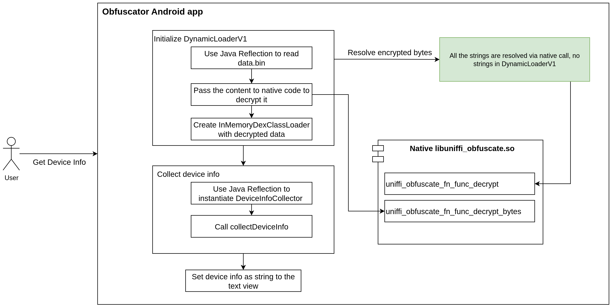

# Android Obfuscation with Rust

This is a sample Android project that demonstrates advanced obfuscation techniques using a native Rust library. The primary goal is to hide sensitive information, such as class names, method names, and other strings, from static analysis tools. This is achieved by encrypting them and only decrypting them at runtime using a native function call.

The project also showcases dynamic class loading, where a feature (in this case, a device information collector) is loaded from an encrypted binary asset at runtime.

## How it Works

The project is divided into two main components:

1.  **Android Application (`app/`)**: A standard Android application written in Kotlin. Instead of directly referencing sensitive classes or strings, it holds them as encrypted byte arrays. At runtime, it calls a native Rust function to decrypt these arrays back into their original form.
2.  **Rust Native Library (`obfuscate-rs/`)**: A Rust library that contains a `decrypt` function. This function is called from the Android app via JNA to decrypt the byte arrays.

### Core Obfuscation Flow

In `MainActivity.kt`, you can see this process in action:

1.  **Encrypted Strings**: Critical strings, such as the class name `com.example.device.DeviceInfoCollector` and the method name `collectDeviceInfo`, are stored as encrypted `ByteArray`s.
2.  **Dynamic Decryption**: The `uniffi.obfuscate.decrypt()` function, which is a Kotlin binding to the native Rust code, is called to decrypt these byte arrays at runtime.
3.  **Reflection**: The decrypted strings are then used with Java reflection to dynamically load the class (`Class.forName()`) and invoke its methods (`Method.invoke()`).

This approach ensures that the actual class and method names are not present as plaintext strings in the final APK, making it significantly harder for reverse-engineering tools to understand the app's logic.

{height=40%, width=40%}

## Project Structure
```
.
├── app/                        # Android application source (Kotlin/Java)
├── obfuscate-rs/               # Rust native library source
│   ├── obfuscate/              # The main Rust crate with FFI definitions
│   ├── obfuscate-core/         # Core decryption logic
│   ├── obfuscate-tools/        # Tools
│   └── Cargo.toml              # Rust dependencies
├── launch_android.sh           # Launches Android via QEMU VM
├── prepare_dynamic_classes.sh  # Script to prepare encrypted dynamic class
├── prepare_native.sh           # Script to build the native library
├── build.gradle.kts            # Main Gradle build file
└── ...
```

## Key Technologies

-   **Android/Kotlin**: For the application layer.
-   **Rust**: For the native decryption logic, providing performance and security.
-   **UniFFI**: A tool for generating high-level, cross-language bindings for Rust libraries.
-   **JNA (Java Native Access)**: Used by the UniFFI-generated code to call the native library without writing manual JNI code.
-   **Cross**: A tool for cross-compiling the Rust library to various Android targets (e.g., `aarch64-linux-android`, `x86_64-linux-android`).

## Building and Running the Project

### Prerequisites

-   Android Studio or Android SDK command-line tools.
-   A configured NDK path in your environment or `local.properties` file.
-   Rust toolchain.
-   `cross` for cross-compilation (`cargo install cross`).

### Build Steps

1.  **Build the Native Library**:
    Run the `prepare_native.sh` script. This script will use `cross` to compile the Rust code in the `obfuscate-rs` directory for all required Android targets. The resulting shared libraries (`.so` files) will be copied into the `app/src/main/jniLibs` directory.

    ```bash
    ./prepare_native.sh
    ```

2.  **Prepare the Dynamic Classes**:
    Run the `prepare_dynamic_classes.sh` script. This script will use `d8` to compile classes in the namespace com.example.device into the Dex file, which will be encrypted and copied into the `app/src/main/assets` directory.

    ```bash
    ./prepare_native.sh
    ```

3.  **Build the Android App**:
    You can now build the Android application using Gradle or directly from Android Studio.

    ```bash
    ./gradlew assembleDebug
    ```

### Running the App

Once the build is complete, you can install the APK on an Android device or emulator. The app will demonstrate the dynamic loading and execution of the obfuscated code when you tap the "Get Device Info" button.

## Advanced: Tracing Native Calls with bpftrace

For those interested in dynamic analysis, this project includes a `bpftrace` script (`tools/trace_native_load.bt`) to monitor the loading of the native library and the resolution of its functions.

`bpftrace` is a powerful tracing tool for Linux that uses eBPF. You can use it on a rooted Android device or emulator to see how the system linker works.

### How to Use

1.  Push the `trace_native_load.bt` script to your device.
2.  Run `bpftrace` against the app's process ID.
3.  The script will trace calls to `dlopen`, `android_dlopen_ext`, and `dlsym`.

You will see output similar to this, showing the OS loading `libuniffi_obfuscate.so` and the app resolving the address of the `uniffi_obfuscate_fn_func_decrypt` function:
```console
✗ DEVICE="vsock:3:5555"; adb -s $DEVICE shell 
x86_64:/ # cd /data/eadb
x86_64:/data/eadb # ls -la
total 48
drwxr-xr-x  3 root   root   4096 2025-10-02 15:58 .
drwxrwx--x 51 system system 4096 2025-10-02 14:42 ..
-rw-rw-rw-  1 root   root    311 2025-05-31 15:50 bashrc
drwxr-xr-x 21 root   root   4096 2025-10-02 14:44 debian
-rwxrwxrwx  1 root   root    238 2025-05-29 14:41 device-remove
-rwxrwxrwx  1 root   root    235 2025-05-29 14:42 device-umount-all
-rwxrwxrwx  1 root   root    672 2025-03-08 13:20 device-unpack
-rwxrwxrwx  1 root   root    311 2025-03-08 13:20 get_kvers.sh
-rwxrwxrwx  1 root   root    132 2025-05-29 14:41 run
-rwxrwxrwx  1 root   root    229 2025-05-29 14:42 run-command
-rwxrwxrwx  1 root   root   1598 2025-06-01 07:15 run.common
x86_64:/data/eadb # cat run
#!/bin/sh
spath=$( cd "$(dirname "$0")" ; pwd -P )
cd $spath

source $spath/run.common

chroot debian/ /bin/bash --rcfile '.bashrc'
x86_64:/data/eadb # ./run
root@localhost:/# bpftrace trace_native_load.bt 
Attaching 6 probes...
android_dlopen_ext(path=/data/app/~~my325jwReT0wsX9qflsCtw==/com.example.obfuscate-fhcJ8JVbczqaFyccGwJRjQ==/base.apk!/lib/x86_64/libjnidispatch.so, mode=2) ret: 0xc3d0eafd26cd3b5d
dlsym(handle=0xc3d0eafd26cd3b5d, name=JNI_OnLoad) ret: 0x799c0704e9c0
dlsym(handle=0xc3d0eafd26cd3b5d, name=Java_com_sun_jna_Native_getNativeVersion) ret: 0x799c0704e980
dlsym(handle=0xc3d0eafd26cd3b5d, name=Java_com_sun_jna_Native_sizeof) ret: 0x799c0704d9d0
dlsym(handle=0xc3d0eafd26cd3b5d, name=Java_com_sun_jna_Native_initIDs) ret: 0x799c0704da60
dlsym(handle=0xc3d0eafd26cd3b5d, name=Java_com_sun_jna_Native_malloc) ret: 0x799c0704d9b0
dlsym(handle=0xc3d0eafd26cd3b5d, name=Java_com_sun_jna_Native_setMemory) ret: 0x799c0704d890
dlsym(handle=0xc3d0eafd26cd3b5d, name=Java_com_sun_jna_Native_getLong) ret: 0x799c0704d7d0
dlsym(handle=0xc3d0eafd26cd3b5d, name=Java_com_sun_jna_Native_getShort) ret: 0x799c0704d7e0
dlsym(handle=0xc3d0eafd26cd3b5d, name=Java_com_sun_jna_Native__1getPointer) ret: 0x799c0704d770
dlsym(handle=0xc3d0eafd26cd3b5d, name=Java_com_sun_jna_Native_setPointer) ret: 0x799c0704d8d0
dlsym(handle=0xc3d0eafd26cd3b5d, name=Java_com_sun_jna_Native_setLong) ret: 0x799c0704d910
dlsym(handle=0xc3d0eafd26cd3b5d, name=Java_com_sun_jna_Native_setShort) ret: 0x799c0704d920
dlsym(handle=0xc3d0eafd26cd3b5d, name=Java_com_sun_jna_Native_open) ret: 0x799c0704d2c0
dlopen(path=libuniffi_obfuscate.so, mode=257) ret: 0x1cc60e1f45345c5
dlsym(handle=0xc3d0eafd26cd3b5d, name=Java_com_sun_jna_Native_findSymbol) ret: 0x799c0704d470
dlsym(handle=0x1cc60e1f45345c5, name=ffi_obfuscate_uniffi_contract_version) ret: 0x799c06e77c60
dlsym(handle=0xc3d0eafd26cd3b5d, name=Java_com_sun_jna_Native_invokeInt) ret: 0x799c0704d1f0
dlsym(handle=0x1cc60e1f45345c5, name=uniffi_obfuscate_checksum_func_decrypt) ret: 0x799c06e77c40
dlsym(handle=0x1cc60e1f45345c5, name=uniffi_obfuscate_checksum_func_decrypt_bytes) ret: 0x799c06e77c50
dlsym(handle=0x1cc60e1f45345c5, name=ffi_obfuscate_rustbuffer_alloc) ret: 0x799c06e77c70
dlsym(handle=0xc3d0eafd26cd3b5d, name=Java_com_sun_jna_Native_setByte) ret: 0x799c0704d8b0
dlsym(handle=0xc3d0eafd26cd3b5d, name=Java_com_sun_jna_Native_invokeStructure) ret: 0x799c0704d150
dlsym(handle=0xc3d0eafd26cd3b5d, name=Java_com_sun_jna_Native_getByte) ret: 0x799c0704d750
dlsym(handle=0xc3d0eafd26cd3b5d, name=Java_com_sun_jna_Native_getDirectByteBuffer) ret: (nil)
dlsym(handle=0xc3d0eafd26cd3b5d, name=Java_com_sun_jna_Native_getDirectByteBuffer__Lcom_sun_jna_Pointer_2JJJ) ret: 0x799c0704d780
dlsym(handle=0x1cc60e1f45345c5, name=uniffi_obfuscate_fn_func_decrypt) ret: 0x799c06e78790
dlsym(handle=0x1cc60e1f45345c5, name=ffi_obfuscate_rustbuffer_free) ret: 0x799c06e77cb0
dlsym(handle=0xc3d0eafd26cd3b5d, name=Java_com_sun_jna_Native_invokeVoid) ret: 0x799c0704d250
dlsym(handle=0x1cc60e1f45345c5, name=uniffi_obfuscate_fn_func_decrypt_bytes) ret: 0x799c06e787d0
```